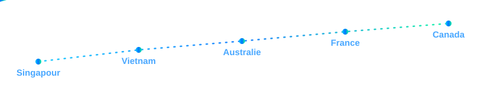
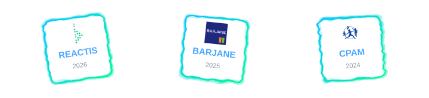

  

  

  
  

  <a href="README.md">🇬🇧 Read in English</a>

## À propos de moi

- Ouvert aux stages en ingénierie logicielle avec des équipes internationales
- Basé à Marseille, France
- Études d'ingénierie informatique à EPITECH
- Passionné par l'IT et les environnements internationaux
- Français d'origine, élevé entre le Vietnam, Singapour et l'Australie
- Bilingue et à l'aise dans les équipes multiculturelles
- Actuellement en 3e année
- En train d'apprendre le C++, Java et Neo4j
- Écrivez-moi à [arnaud.jouan@epitech.eu](mailto:arnaud.jouan@epitech.eu)

## Mon parcours

  

## Technologies

  
  

  

## Expérience en stage

  

<h3>
  
  REACTIS Group
</h3>

- Rôle : Stagiaire développeur logiciel
- Période : mars 2026 - aujourd'hui
- Projet : Application de maintenance aéronautique
- Objectif : Développer et maintenir des fonctionnalités Java en production, avec un code propre et testable
- Points forts :
  - Développement et livraison de fonctionnalités en équipe agile, contribution aux sprints
  - Contribution à la qualité via des revues de code et la correction de bugs
- Environnement technique : Java, SQL, Neo4j, Python

<h3>
  
  BARJANE
</h3>

- Rôle : Stagiaire référent IT interne
- Période : sept 2025 - fév 2026
- Mission : Point de contact IT interne sur des initiatives transverses et stratégiques
- Points d'impact :
  - Sécurisation de l'infrastructure via la conception d'un Plan de Reprise d'Activité (PRA) avec des partenaires IT externes et la livraison d'un inventaire matériel/logiciel complet
  - Automatisation de workflows internes répétitifs avec des macros Excel avancées, des flux Power Automate et de la planification de tâches
  - Amélioration de la présence digitale via des audits techniques, la modernisation de trois sites existants et la contribution au lancement d'un nouveau site
  - Support quotidien des équipes et traduction des contraintes techniques en solutions concrètes et accessibles
- Résultat : Fiabilité accrue de l'infrastructure, charge manuelle réduite et modernisation digitale accélérée

<h3>
  
  CPAM des Bouches-du-Rhône (Assurance Maladie)
</h3>

- Rôle : Stagiaire développeur Java
- Période : sept 2024 - déc 2024
- Projet : AIDA (CNAM/CPAM)
- Points d'impact :
  - Modernisation de l'architecture cœur en migrant l'infrastructure technique du Socle 2 au Socle 3
  - Montée de version du code Java de Java 6 à Java 8 et résolution des problèmes de compatibilité des modules legacy
  - Refactorisation de composants critiques pour améliorer les performances tout en préservant la stabilité de l'application
  - Amélioration de la qualité et de la sécurité avec SonarQube en réduisant les vulnérabilités et en appliquant les standards de code
  - Conception et implémentation de tests unitaires : AIDA_J (70% de couverture) et AIDA_X (52% de couverture)
- Environnement technique : SonarQube, Eclipse, WebLogic, ViewVC, SoapUI, Castor
- Résultat : Migration livrée avec succès, fiabilité renforcée, meilleure posture de sécurité et maintenabilité à long terme améliorée
- Contexte AIDA : Outil interne utilisé par la CNAM/CPAM pour récupérer automatiquement les périodes d'inscription à Pôle emploi des assurés, réduisant les erreurs et accélérant les traitements de droits

  

## Me contacter

  
  
  
  

## Statistiques GitHub

  
  

  

  git@github.com:Arjouan/Arjouan.git

  

