

  <picture>
    <source media="(max-width: 600px) and (prefers-color-scheme: light)" srcset="https://github.com/Arjouan/Arjouan/raw/main/boarding-pass-header.fr.mobile.light.svg" />
    <source media="(max-width: 600px)" srcset="https://github.com/Arjouan/Arjouan/raw/main/boarding-pass-header.fr.mobile.svg" />
    <source media="(prefers-color-scheme: light)" srcset="https://github.com/Arjouan/Arjouan/raw/main/boarding-pass-header.fr.light.svg" />
    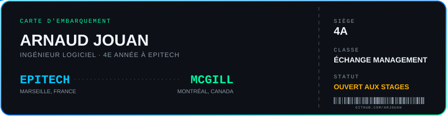
  </picture>

  <picture>
    <source media="(max-width: 600px) and (prefers-color-scheme: light)" srcset="https://github.com/Arjouan/Arjouan/raw/main/departure-board.fr.mobile.light.svg" />
    <source media="(max-width: 600px)" srcset="https://github.com/Arjouan/Arjouan/raw/main/departure-board.fr.mobile.svg" />
    <source media="(prefers-color-scheme: light)" srcset="https://github.com/Arjouan/Arjouan/raw/main/departure-board.fr.light.svg" />
    
  </picture>

  <picture>
    <source media="(max-width: 600px) and (prefers-color-scheme: light)" srcset="https://github.com/Arjouan/Arjouan/raw/main/time-chip.fr.mobile.light.svg" />
    <source media="(max-width: 600px)" srcset="https://github.com/Arjouan/Arjouan/raw/main/time-chip.fr.mobile.svg" />
    <source media="(prefers-color-scheme: light)" srcset="https://github.com/Arjouan/Arjouan/raw/main/time-chip.fr.light.svg" />
    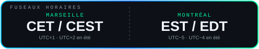
  </picture>

  <a href="README.md">🇬🇧 Read in English</a>

  <picture>
    <source media="(max-width: 600px) and (prefers-color-scheme: light)" srcset="https://github.com/Arjouan/Arjouan/raw/main/assets/gate-about.fr.mobile.light.svg" />
    <source media="(max-width: 600px)" srcset="https://github.com/Arjouan/Arjouan/raw/main/assets/gate-about.fr.mobile.svg" />
    <source media="(prefers-color-scheme: light)" srcset="https://github.com/Arjouan/Arjouan/raw/main/assets/gate-about.fr.light.svg" />
    
  </picture>

<picture>
  <source media="(max-width: 600px)" srcset="https://github.com/Arjouan/Arjouan/raw/main/assets/blank.svg" />
  
</picture>

- Ouvert aux stages en ingénierie logicielle avec des équipes internationales
- Actuellement à Montréal pour un échange d'un an à McGill University (port d'attache : Marseille, France)
- Français d'origine, élevé entre le Vietnam, Singapour et l'Australie
- Étudiant en 4e année d'ingénierie informatique à EPITECH, en management à McGill cette année
- En train de développer [Meridian](https://github.com/Arjouan/Meridian), un système de gestion de flotte maritime (NestJS, Prisma, PostGIS, Next.js)
- Livraison de code Java en production chez REACTIS sur une application de maintenance aéronautique
- Écrivez-moi à [arnaud.jouan@epitech.eu](mailto:arnaud.jouan@epitech.eu)

 

<picture>
  <source media="(min-width: 601px)" srcset="https://github.com/Arjouan/Arjouan/raw/main/assets/blank.svg" />
  
</picture>

  <picture>
    <source media="(max-width: 600px) and (prefers-color-scheme: light)" srcset="https://github.com/Arjouan/Arjouan/raw/main/assets/gate-journey.fr.mobile.light.svg" />
    <source media="(max-width: 600px)" srcset="https://github.com/Arjouan/Arjouan/raw/main/assets/gate-journey.fr.mobile.svg" />
    <source media="(prefers-color-scheme: light)" srcset="https://github.com/Arjouan/Arjouan/raw/main/assets/gate-journey.fr.light.svg" />
    
  </picture>

  <picture>
    <source media="(max-width: 600px) and (prefers-color-scheme: light)" srcset="https://github.com/Arjouan/Arjouan/raw/main/journey.fr.mobile.light.svg" />
    <source media="(max-width: 600px)" srcset="https://github.com/Arjouan/Arjouan/raw/main/journey.fr.mobile.svg" />
    <source media="(prefers-color-scheme: light)" srcset="https://github.com/Arjouan/Arjouan/raw/main/journey.fr.light.svg" />
    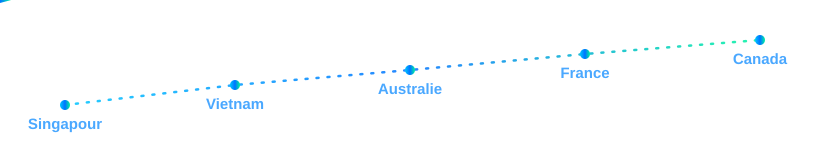
  </picture>

  <picture>
    <source media="(max-width: 600px) and (prefers-color-scheme: light)" srcset="https://github.com/Arjouan/Arjouan/raw/main/assets/gate-stack.fr.mobile.light.svg" />
    <source media="(max-width: 600px)" srcset="https://github.com/Arjouan/Arjouan/raw/main/assets/gate-stack.fr.mobile.svg" />
    <source media="(prefers-color-scheme: light)" srcset="https://github.com/Arjouan/Arjouan/raw/main/assets/gate-stack.fr.light.svg" />
    
  </picture>

  <picture>
    <source media="(max-width: 600px) and (prefers-color-scheme: light)" srcset="https://github.com/Arjouan/Arjouan/raw/main/assets/luggage-tags.fr.mobile.light.svg" />
    <source media="(max-width: 600px)" srcset="https://github.com/Arjouan/Arjouan/raw/main/assets/luggage-tags.fr.mobile.svg" />
    <source media="(prefers-color-scheme: light)" srcset="https://github.com/Arjouan/Arjouan/raw/main/assets/luggage-tags.fr.light.svg" />
    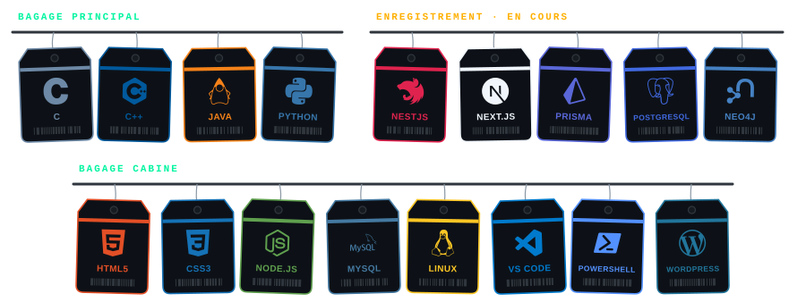
  </picture>

  <picture>
    <source media="(max-width: 600px) and (prefers-color-scheme: light)" srcset="https://github.com/Arjouan/Arjouan/raw/main/assets/gate-internships.fr.mobile.light.svg" />
    <source media="(max-width: 600px)" srcset="https://github.com/Arjouan/Arjouan/raw/main/assets/gate-internships.fr.mobile.svg" />
    <source media="(prefers-color-scheme: light)" srcset="https://github.com/Arjouan/Arjouan/raw/main/assets/gate-internships.fr.light.svg" />
    
  </picture>

  <picture>
    <source media="(max-width: 600px) and (prefers-color-scheme: light)" srcset="https://github.com/Arjouan/Arjouan/raw/main/passport-stamps.mobile.light.svg" />
    <source media="(max-width: 600px)" srcset="https://github.com/Arjouan/Arjouan/raw/main/passport-stamps.mobile.svg" />
    <source media="(prefers-color-scheme: light)" srcset="https://github.com/Arjouan/Arjouan/raw/main/passport-stamps.light.svg" />
    
  </picture>

<h3>REACTIS Group</h3>

**Stagiaire développeur logiciel · mars 2026 - août 2026 · 6 mois**

Détails de la mission

- Projet : Application de maintenance aéronautique
- Objectif : Développé et maintenu des fonctionnalités Java en production, avec un code propre et testable
- Points forts :
  - Développement et livraison de fonctionnalités en équipe agile, contribution aux sprints
  - Contribution à la qualité via des revues de code et la correction de bugs
- Environnement technique : Java, SQL, Neo4j, Python

<h3>BARJANE</h3>

**Stagiaire référent IT interne · sept 2025 - fév 2026**

Détails de la mission

- Mission : Point de contact IT interne sur des initiatives transverses et stratégiques
- Points d'impact :
  - Sécurisation de l'infrastructure via la conception d'un Plan de Reprise d'Activité (PRA) avec des partenaires IT externes et la livraison d'un inventaire matériel/logiciel complet
  - Automatisation de workflows internes répétitifs avec des macros Excel avancées, des flux Power Automate et de la planification de tâches
  - Amélioration de la présence digitale via des audits techniques, la modernisation de trois sites existants et la contribution au lancement d'un nouveau site
  - Support quotidien des équipes et traduction des contraintes techniques en solutions concrètes et accessibles
- Résultat : Fiabilité accrue de l'infrastructure, charge manuelle réduite et modernisation digitale accélérée

<h3>CPAM des Bouches-du-Rhône (Assurance Maladie)</h3>

**Stagiaire développeur Java · sept 2024 - déc 2024**

Détails de la mission

- Projet : AIDA (CNAM/CPAM)
- Points d'impact :
  - Modernisation de l'architecture cœur en migrant l'infrastructure technique du Socle 2 au Socle 3
  - Montée de version du code Java de Java 6 à Java 8 et résolution des problèmes de compatibilité des modules legacy
  - Refactorisation de composants critiques pour améliorer les performances tout en préservant la stabilité de l'application
  - Amélioration de la qualité et de la sécurité avec SonarQube en réduisant les vulnérabilités et en appliquant les standards de code
  - Conception et implémentation de tests unitaires : AIDA_J (70% de couverture) et AIDA_X (52% de couverture)
- Environnement technique : SonarQube, Eclipse, WebLogic, ViewVC, SoapUI, Castor
- Résultat : Migration livrée avec succès, fiabilité renforcée, meilleure posture de sécurité et maintenabilité à long terme améliorée
- Contexte AIDA : Outil interne utilisé par la CNAM/CPAM pour récupérer automatiquement les périodes d'inscription à Pôle emploi des assurés, réduisant les erreurs et accélérant les traitements de droits

  <picture>
    <source media="(max-width: 600px) and (prefers-color-scheme: light)" srcset="https://github.com/Arjouan/Arjouan/raw/main/assets/gate-manifest.fr.mobile.light.svg" />
    <source media="(max-width: 600px)" srcset="https://github.com/Arjouan/Arjouan/raw/main/assets/gate-manifest.fr.mobile.svg" />
    <source media="(prefers-color-scheme: light)" srcset="https://github.com/Arjouan/Arjouan/raw/main/assets/gate-manifest.fr.light.svg" />
    
  </picture>

  <a href="https://github.com/Arjouan/Meridian">
    <picture>
      <source media="(max-width: 600px) and (prefers-color-scheme: light)" srcset="https://github.com/Arjouan/Arjouan/raw/main/assets/project-meridian.fr.mobile.light.svg" />
      <source media="(max-width: 600px)" srcset="https://github.com/Arjouan/Arjouan/raw/main/assets/project-meridian.fr.mobile.svg" />
      <source media="(prefers-color-scheme: light)" srcset="https://github.com/Arjouan/Arjouan/raw/main/assets/project-meridian.fr.light.svg" />
      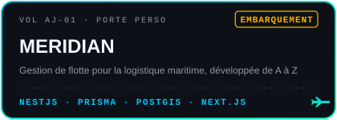
    </picture>
  </a>
  <a href="https://github.com/Arjouan/rtype">
    <picture>
      <source media="(max-width: 600px) and (prefers-color-scheme: light)" srcset="https://github.com/Arjouan/Arjouan/raw/main/assets/project-rtype.fr.mobile.light.svg" />
      <source media="(max-width: 600px)" srcset="https://github.com/Arjouan/Arjouan/raw/main/assets/project-rtype.fr.mobile.svg" />
      <source media="(prefers-color-scheme: light)" srcset="https://github.com/Arjouan/Arjouan/raw/main/assets/project-rtype.fr.light.svg" />
      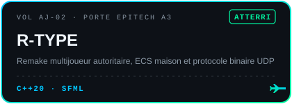
    </picture>
  </a>

  <a href="https://github.com/Arjouan/area">
    <picture>
      <source media="(max-width: 600px) and (prefers-color-scheme: light)" srcset="https://github.com/Arjouan/Arjouan/raw/main/assets/project-area.fr.mobile.light.svg" />
      <source media="(max-width: 600px)" srcset="https://github.com/Arjouan/Arjouan/raw/main/assets/project-area.fr.mobile.svg" />
      <source media="(prefers-color-scheme: light)" srcset="https://github.com/Arjouan/Arjouan/raw/main/assets/project-area.fr.light.svg" />
      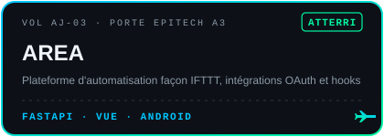
    </picture>
  </a>
  <a href="https://github.com/Arjouan/zappy">
    <picture>
      <source media="(max-width: 600px) and (prefers-color-scheme: light)" srcset="https://github.com/Arjouan/Arjouan/raw/main/assets/project-zappy.fr.mobile.light.svg" />
      <source media="(max-width: 600px)" srcset="https://github.com/Arjouan/Arjouan/raw/main/assets/project-zappy.fr.mobile.svg" />
      <source media="(prefers-color-scheme: light)" srcset="https://github.com/Arjouan/Arjouan/raw/main/assets/project-zappy.fr.light.svg" />
      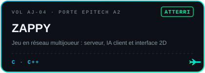
    </picture>
  </a>

  <a href="https://arjouan.github.io/Portfolio/">
    <picture>
      <source media="(max-width: 600px) and (prefers-color-scheme: light)" srcset="https://github.com/Arjouan/Arjouan/raw/main/flight-manifest-portfolio.fr.mobile.light.svg" />
      <source media="(max-width: 600px)" srcset="https://github.com/Arjouan/Arjouan/raw/main/flight-manifest-portfolio.fr.mobile.svg" />
      <source media="(prefers-color-scheme: light)" srcset="https://github.com/Arjouan/Arjouan/raw/main/flight-manifest-portfolio.fr.light.svg" />
      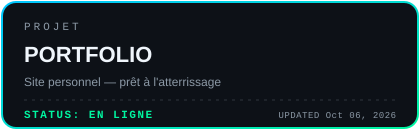
    </picture>
  </a>
  <a href="https://github.com/Arjouan?tab=repositories">
    <picture>
      <source media="(max-width: 600px) and (prefers-color-scheme: light)" srcset="https://github.com/Arjouan/Arjouan/raw/main/flight-manifest-epitech.fr.mobile.light.svg" />
      <source media="(max-width: 600px)" srcset="https://github.com/Arjouan/Arjouan/raw/main/flight-manifest-epitech.fr.mobile.svg" />
      <source media="(prefers-color-scheme: light)" srcset="https://github.com/Arjouan/Arjouan/raw/main/flight-manifest-epitech.fr.light.svg" />
      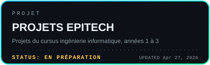
    </picture>
  </a>

Plus de détails sur le [Portfolio](https://arjouan.github.io/Portfolio/projects.html), y compris mon rôle précis sur chaque projet de groupe.

  📁 <a href="https://github.com/Arjouan/Epitech-Year-1-Projects">Année 1</a> ·
  <a href="https://github.com/Arjouan/Epitech-Year-2-Projects">Année 2</a> ·
  <a href="https://github.com/Arjouan/Epitech-Year-3-Projects">Année 3</a>

  <picture>
    <source media="(max-width: 600px) and (prefers-color-scheme: light)" srcset="https://github.com/Arjouan/Arjouan/raw/main/assets/gate-connect.fr.mobile.light.svg" />
    <source media="(max-width: 600px)" srcset="https://github.com/Arjouan/Arjouan/raw/main/assets/gate-connect.fr.mobile.svg" />
    <source media="(prefers-color-scheme: light)" srcset="https://github.com/Arjouan/Arjouan/raw/main/assets/gate-connect.fr.light.svg" />
    
  </picture>

  <a href="https://discord.com/users/super.45">
    <picture>
      <source media="(prefers-color-scheme: light)" srcset="https://github.com/Arjouan/Arjouan/raw/main/connect-discord.light.svg" />
      
    </picture>
  </a>
  <a href="https://github.com/Arjouan">
    <picture>
      <source media="(prefers-color-scheme: light)" srcset="https://github.com/Arjouan/Arjouan/raw/main/connect-github.light.svg" />
      
    </picture>
  </a>
  <a href="https://arjouan.github.io/Portfolio/">
    <picture>
      <source media="(prefers-color-scheme: light)" srcset="https://github.com/Arjouan/Arjouan/raw/main/connect-portfolio.light.svg" />
      
    </picture>
  </a>
  <a href="https://www.linkedin.com/in/arnaud-jouan-613a53263">
    <picture>
      <source media="(prefers-color-scheme: light)" srcset="https://github.com/Arjouan/Arjouan/raw/main/connect-linkedin.light.svg" />
      
    </picture>
  </a>

  <picture>
    <source media="(max-width: 600px) and (prefers-color-scheme: light)" srcset="https://github.com/Arjouan/Arjouan/raw/main/assets/gate-log.fr.mobile.light.svg" />
    <source media="(max-width: 600px)" srcset="https://github.com/Arjouan/Arjouan/raw/main/assets/gate-log.fr.mobile.svg" />
    <source media="(prefers-color-scheme: light)" srcset="https://github.com/Arjouan/Arjouan/raw/main/assets/gate-log.fr.light.svg" />
    
  </picture>

  <picture>
    <source media="(max-width: 600px) and (prefers-color-scheme: light)" srcset="https://github.com/Arjouan/Arjouan/raw/main/flight-log.fr.mobile.light.svg" />
    <source media="(max-width: 600px)" srcset="https://github.com/Arjouan/Arjouan/raw/main/flight-log.fr.mobile.svg" />
    <source media="(prefers-color-scheme: light)" srcset="https://github.com/Arjouan/Arjouan/raw/main/flight-log.fr.light.svg" />
    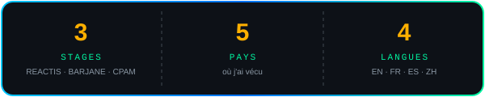
  </picture>

  <picture>
    <source media="(max-width: 600px) and (prefers-color-scheme: light)" srcset="https://github.com/Arjouan/Arjouan/raw/main/flight-radar.fr.mobile.light.svg" />
    <source media="(max-width: 600px)" srcset="https://github.com/Arjouan/Arjouan/raw/main/flight-radar.fr.mobile.svg" />
    <source media="(prefers-color-scheme: light)" srcset="https://github.com/Arjouan/Arjouan/raw/main/flight-radar.fr.light.svg" />
    
  </picture>

  <picture>
    <source media="(max-width: 600px) and (prefers-color-scheme: light)" srcset="https://github.com/Arjouan/Arjouan/raw/main/boarding-pass-footer.fr.mobile.light.svg" />
    <source media="(max-width: 600px)" srcset="https://github.com/Arjouan/Arjouan/raw/main/boarding-pass-footer.fr.mobile.svg" />
    <source media="(prefers-color-scheme: light)" srcset="https://github.com/Arjouan/Arjouan/raw/main/boarding-pass-footer.fr.light.svg" />
    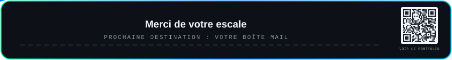
  </picture>

