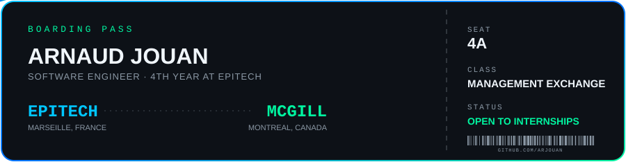
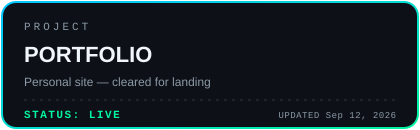
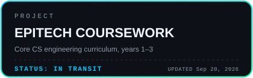
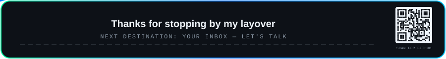

  

  

  

  

  <a href="README.fr.md">🇫🇷 Lire en français</a>

## About Me

<table>
<tr>
<td width="55%" valign="top">

- Open to software engineering internships with international teams
- Based in Marseille, France
- Studying Computer Science Engineering at EPITECH
- Passionate about IT and international environments
- French native, raised across Vietnam, Singapore, and Australia
- Bilingual and comfortable adapting to multicultural teams
- Now a 4th year student, on a 1-year exchange program at McGill University studying Management
- Currently learning C++, Java and Neo4j
- Reach me at [arnaud.jouan@epitech.eu](mailto:arnaud.jouan@epitech.eu)

</td>
<td width="45%" valign="top">

</td>
</tr>
</table>

## My Journey

  

## Tech Stack

  

  

## Internship Experience

  

<h3>
  
  REACTIS Group
</h3>

- Role: Software Developer Intern
- Period: Mar 2026 - Aug 2026 · 6 mos
- Project: Aeronautical maintenance application
- Focus: Developed and maintained production Java features with clean, testable code
- Highlights:
  - Built and shipped features in an agile team and supported sprint delivery
  - Contributed to code quality through code reviews and bug fixing
- Tech Environment: Java, SQL, Neo4j, Python

<h3>
  
  BARJANE
</h3>

- Role: Internal IT Referent Intern
- Period: Sep 2025 - Feb 2026
- Mission: Acted as the internal IT point of contact on cross-functional and strategic initiatives
- Impact Highlights:
  - Secured infrastructure by designing a Business Continuity/Disaster Recovery approach (PRA) with external IT partners and delivering a full hardware/software inventory
  - Automated repetitive internal workflows using advanced Excel macros, Power Automate flows, and task scheduling
  - Boosted digital presence via technical audits, modernization of three existing websites, and contribution to a new website launch
  - Supported teams daily and translated technical constraints into actionable, business-friendly solutions
- Outcome: Increased infrastructure reliability, reduced manual workload, and accelerated digital modernization

<h3>
  
  CPAM des Bouches-du-Rhône (Assurance Maladie)
</h3>

- Role: Java Developer Intern
- Period: Sep 2024 - Dec 2024
- Project: AIDA (CNAM/CPAM)
- Impact Highlights:
  - Modernized core architecture by migrating technical infrastructure from Socle 2 to Socle 3
  - Upgraded Java codebase from Java 6 to Java 8 and resolved compatibility issues in legacy modules
  - Refactored critical components to improve performance while preserving application stability
  - Improved quality and security with SonarQube by reducing vulnerabilities and enforcing coding standards
  - Designed and implemented unit tests: AIDA_J (70% coverage) and AIDA_X (52% coverage)
- Tech Environment: SonarQube, Eclipse, WebLogic, ViewVC, SoapUI, Castor
- Outcome: Successful migration delivery, stronger reliability, improved security posture, and better long-term maintainability
- AIDA Context: Internal tool used by CNAM/CPAM to automatically retrieve insured users' Pôle emploi registration periods, reducing errors and speeding up entitlement workflows

  

## Featured Projects

| Project | What it is | Stack |
|---|---|---|
| [R-Type](https://github.com/Arjouan/rtype) | Authoritative C++20 multiplayer remake of the 1987 arcade classic, with a custom ECS and a UDP-first binary protocol | C++20, SFML |
| [AREA](https://github.com/Arjouan/area) | Action-Reaction automation platform (IFTTT-style) with OAuth integrations, hooks, and schedulers | FastAPI, Vue, Android |
| [Zappy](https://github.com/Arjouan/zappy) | Multiplayer network game: server, AI client, and 2D GUI over a custom protocol | C, C++ |
| [Arcade](https://github.com/Arjouan/arcade) | Game engine with dynamically loaded graphics and game modules | C++ |
| [Raytracer](https://github.com/Arjouan/raytracer) | Configurable raytracer with lighting and scene files | C++ |

More on the [Portfolio](https://arjouan.github.io/Portfolio/projects.html), including my specific role on each team project.

  

## Flight Manifest

  
  

  📁 <a href="https://github.com/Arjouan/Epitech-Year-1-Projects">Year 1</a> ·
  <a href="https://github.com/Arjouan/Epitech-Year-2-Projects">Year 2</a> ·
  <a href="https://github.com/Arjouan/Epitech-Year-3-Projects">Year 3</a>

  

## Connect With Me

  
  
  
  

## Flight Log

  

  git@github.com:Arjouan/Arjouan.git

  

