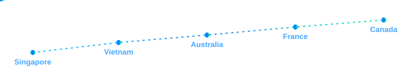

  

  

  
  

  <a href="README.fr.md">🇫🇷 Lire en français</a>

## About Me

- Open to software engineering internships with international teams
- Based in Marseille, France
- Studying Computer Science Engineering at EPITECH
- Passionate about IT and international environments
- French native, raised across Vietnam, Singapore, and Australia
- Bilingual and comfortable adapting to multicultural teams
- Now a 3rd year student
- Currently learning C++, Java and Neo4j
- Reach me at [arnaud.jouan@epitech.eu](mailto:arnaud.jouan@epitech.eu)

## My Journey

  

  🇸🇬 Singapore &nbsp;→&nbsp; 🇻🇳 Vietnam &nbsp;→&nbsp; 🇦🇺 Australia &nbsp;→&nbsp; 🇫🇷 France &nbsp;→&nbsp; 🇨🇦 Canada (soon)

## Tech Stack

  
  

  

## Internship Experience

<h3>
  
  REACTIS Group
</h3>

- Role: Software Developer Intern
- Period: Mar 2026 - Present
- Focus: Java development, team delivery, and production-ready code
- Highlights:
  - Contributing to real-world software features in an agile environment
  - Strengthening backend development skills through Java-focused implementation work

<h3>
  
  BARJANE
</h3>

- Role: Internal IT Referent Intern
- Period: Sep 2025 - Feb 2026
- Mission: Acted as the internal IT point of contact on cross-functional and strategic initiatives
- Impact Highlights:
  - Secured infrastructure by designing a Business Continuity/Disaster Recovery approach (PRA) with external IT partners and delivering a full hardware/software inventory
  - Automated repetitive internal workflows using advanced Excel macros, Power Automate flows, and task scheduling
  - Boosted digital presence via technical audits, modernization of three existing websites, and contribution to a new website launch
  - Supported teams daily and translated technical constraints into actionable, business-friendly solutions
- Outcome: Increased infrastructure reliability, reduced manual workload, and accelerated digital modernization

<h3>
  
  CPAM des Bouches-du-Rhône (Assurance Maladie)
</h3>

- Role: Java Developer Intern
- Period: Sep 2024 - Dec 2024
- Project: AIDA (CNAM/CPAM)
- Impact Highlights:
  - Modernized core architecture by migrating technical infrastructure from Socle 2 to Socle 3
  - Upgraded Java codebase from Java 6 to Java 8 and resolved compatibility issues in legacy modules
  - Refactored critical components to improve performance while preserving application stability
  - Improved quality and security with SonarQube by reducing vulnerabilities and enforcing coding standards
  - Designed and implemented unit tests: AIDA_J (70% coverage) and AIDA_X (52% coverage)
- Tech Environment: SonarQube, Eclipse, WebLogic, ViewVC, SoapUI, Castor
- Outcome: Successful migration delivery, stronger reliability, improved security posture, and better long-term maintainability
- AIDA Context: Internal tool used by CNAM/CPAM to automatically retrieve insured users' Pôle emploi registration periods, reducing errors and speeding up entitlement workflows

  

## Connect With Me

  
  
  
  

## GitHub Stats

  
  

  

  git@github.com:Arjouan/Arjouan.git

  

