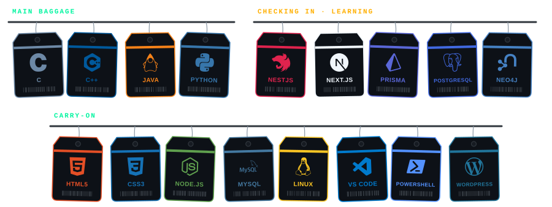
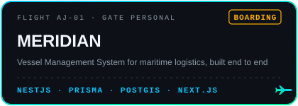
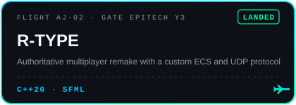
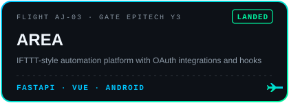
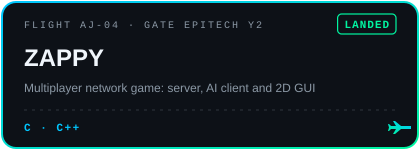

  <picture>
    <source media="(max-width: 600px) and (prefers-color-scheme: light)" srcset="https://github.com/Arjouan/Arjouan/raw/main/boarding-pass-header.mobile.light.svg" />
    <source media="(max-width: 600px)" srcset="https://github.com/Arjouan/Arjouan/raw/main/boarding-pass-header.mobile.svg" />
    <source media="(prefers-color-scheme: light)" srcset="https://github.com/Arjouan/Arjouan/raw/main/boarding-pass-header.light.svg" />
    
  </picture>

  <picture>
    <source media="(max-width: 600px) and (prefers-color-scheme: light)" srcset="https://github.com/Arjouan/Arjouan/raw/main/departure-board.mobile.light.svg" />
    <source media="(max-width: 600px)" srcset="https://github.com/Arjouan/Arjouan/raw/main/departure-board.mobile.svg" />
    <source media="(prefers-color-scheme: light)" srcset="https://github.com/Arjouan/Arjouan/raw/main/departure-board.light.svg" />
    
  </picture>

  <picture>
    <source media="(max-width: 600px) and (prefers-color-scheme: light)" srcset="https://github.com/Arjouan/Arjouan/raw/main/time-chip.mobile.light.svg" />
    <source media="(max-width: 600px)" srcset="https://github.com/Arjouan/Arjouan/raw/main/time-chip.mobile.svg" />
    <source media="(prefers-color-scheme: light)" srcset="https://github.com/Arjouan/Arjouan/raw/main/time-chip.light.svg" />
    
  </picture>

  <a href="README.fr.md">🇫🇷 Lire en français</a>

  <picture>
    <source media="(max-width: 600px) and (prefers-color-scheme: light)" srcset="https://github.com/Arjouan/Arjouan/raw/main/assets/gate-about.mobile.light.svg" />
    <source media="(max-width: 600px)" srcset="https://github.com/Arjouan/Arjouan/raw/main/assets/gate-about.mobile.svg" />
    <source media="(prefers-color-scheme: light)" srcset="https://github.com/Arjouan/Arjouan/raw/main/assets/gate-about.light.svg" />
    
  </picture>

<picture>
  <source media="(max-width: 600px)" srcset="https://github.com/Arjouan/Arjouan/raw/main/assets/blank.svg" />
  
</picture>

- Open to software engineering internships with international teams
- Currently in Montreal on a 1-year exchange at McGill University (home base: Marseille, France)
- French native, raised across Vietnam, Singapore, and Australia
- 4th year Computer Science Engineering student at EPITECH, studying Management at McGill this year
- Currently building [Meridian](https://github.com/Arjouan/Meridian), a maritime Vessel Management System (NestJS, Prisma, PostGIS, Next.js)
- Shipped production Java at REACTIS on an aeronautical maintenance application
- Reach me at [arnaud.jouan@epitech.eu](mailto:arnaud.jouan@epitech.eu)

 

<picture>
  <source media="(min-width: 601px)" srcset="https://github.com/Arjouan/Arjouan/raw/main/assets/blank.svg" />
  
</picture>

  <picture>
    <source media="(max-width: 600px) and (prefers-color-scheme: light)" srcset="https://github.com/Arjouan/Arjouan/raw/main/assets/gate-journey.mobile.light.svg" />
    <source media="(max-width: 600px)" srcset="https://github.com/Arjouan/Arjouan/raw/main/assets/gate-journey.mobile.svg" />
    <source media="(prefers-color-scheme: light)" srcset="https://github.com/Arjouan/Arjouan/raw/main/assets/gate-journey.light.svg" />
    
  </picture>

  <picture>
    <source media="(max-width: 600px) and (prefers-color-scheme: light)" srcset="https://github.com/Arjouan/Arjouan/raw/main/journey.mobile.light.svg" />
    <source media="(max-width: 600px)" srcset="https://github.com/Arjouan/Arjouan/raw/main/journey.mobile.svg" />
    <source media="(prefers-color-scheme: light)" srcset="https://github.com/Arjouan/Arjouan/raw/main/journey.light.svg" />
    
  </picture>

  <picture>
    <source media="(max-width: 600px) and (prefers-color-scheme: light)" srcset="https://github.com/Arjouan/Arjouan/raw/main/assets/gate-stack.mobile.light.svg" />
    <source media="(max-width: 600px)" srcset="https://github.com/Arjouan/Arjouan/raw/main/assets/gate-stack.mobile.svg" />
    <source media="(prefers-color-scheme: light)" srcset="https://github.com/Arjouan/Arjouan/raw/main/assets/gate-stack.light.svg" />
    
  </picture>

  <picture>
    <source media="(max-width: 600px) and (prefers-color-scheme: light)" srcset="https://github.com/Arjouan/Arjouan/raw/main/assets/luggage-tags.mobile.light.svg" />
    <source media="(max-width: 600px)" srcset="https://github.com/Arjouan/Arjouan/raw/main/assets/luggage-tags.mobile.svg" />
    <source media="(prefers-color-scheme: light)" srcset="https://github.com/Arjouan/Arjouan/raw/main/assets/luggage-tags.light.svg" />
    
  </picture>

  <picture>
    <source media="(max-width: 600px) and (prefers-color-scheme: light)" srcset="https://github.com/Arjouan/Arjouan/raw/main/assets/gate-internships.mobile.light.svg" />
    <source media="(max-width: 600px)" srcset="https://github.com/Arjouan/Arjouan/raw/main/assets/gate-internships.mobile.svg" />
    <source media="(prefers-color-scheme: light)" srcset="https://github.com/Arjouan/Arjouan/raw/main/assets/gate-internships.light.svg" />
    
  </picture>

  <picture>
    <source media="(max-width: 600px) and (prefers-color-scheme: light)" srcset="https://github.com/Arjouan/Arjouan/raw/main/passport-stamps.mobile.light.svg" />
    <source media="(max-width: 600px)" srcset="https://github.com/Arjouan/Arjouan/raw/main/passport-stamps.mobile.svg" />
    <source media="(prefers-color-scheme: light)" srcset="https://github.com/Arjouan/Arjouan/raw/main/passport-stamps.light.svg" />
    
  </picture>

<h3>REACTIS Group</h3>

**Software Developer Intern · Mar 2026 - Aug 2026 · 6 mos**

Mission details

- Project: Aeronautical maintenance application
- Focus: Developed and maintained production Java features with clean, testable code
- Highlights:
  - Built and shipped features in an agile team and supported sprint delivery
  - Contributed to code quality through code reviews and bug fixing
- Tech Environment: Java, SQL, Neo4j, Python

<h3>BARJANE</h3>

**Internal IT Referent Intern · Sep 2025 - Feb 2026**

Mission details

- Mission: Acted as the internal IT point of contact on cross-functional and strategic initiatives
- Impact Highlights:
  - Secured infrastructure by designing a Business Continuity/Disaster Recovery approach (PRA) with external IT partners and delivering a full hardware/software inventory
  - Automated repetitive internal workflows using advanced Excel macros, Power Automate flows, and task scheduling
  - Boosted digital presence via technical audits, modernization of three existing websites, and contribution to a new website launch
  - Supported teams daily and translated technical constraints into actionable, business-friendly solutions
- Outcome: Increased infrastructure reliability, reduced manual workload, and accelerated digital modernization

<h3>CPAM des Bouches-du-Rhône (Assurance Maladie)</h3>

**Java Developer Intern · Sep 2024 - Dec 2024**

Mission details

- Project: AIDA (CNAM/CPAM)
- Impact Highlights:
  - Modernized core architecture by migrating technical infrastructure from Socle 2 to Socle 3
  - Upgraded Java codebase from Java 6 to Java 8 and resolved compatibility issues in legacy modules
  - Refactored critical components to improve performance while preserving application stability
  - Improved quality and security with SonarQube by reducing vulnerabilities and enforcing coding standards
  - Designed and implemented unit tests: AIDA_J (70% coverage) and AIDA_X (52% coverage)
- Tech Environment: SonarQube, Eclipse, WebLogic, ViewVC, SoapUI, Castor
- Outcome: Successful migration delivery, stronger reliability, improved security posture, and better long-term maintainability
- AIDA Context: Internal tool used by CNAM/CPAM to automatically retrieve insured users' Pôle emploi registration periods, reducing errors and speeding up entitlement workflows

  <picture>
    <source media="(max-width: 600px) and (prefers-color-scheme: light)" srcset="https://github.com/Arjouan/Arjouan/raw/main/assets/gate-manifest.mobile.light.svg" />
    <source media="(max-width: 600px)" srcset="https://github.com/Arjouan/Arjouan/raw/main/assets/gate-manifest.mobile.svg" />
    <source media="(prefers-color-scheme: light)" srcset="https://github.com/Arjouan/Arjouan/raw/main/assets/gate-manifest.light.svg" />
    
  </picture>

  <a href="https://github.com/Arjouan/Meridian">
    <picture>
      <source media="(max-width: 600px) and (prefers-color-scheme: light)" srcset="https://github.com/Arjouan/Arjouan/raw/main/assets/project-meridian.mobile.light.svg" />
      <source media="(max-width: 600px)" srcset="https://github.com/Arjouan/Arjouan/raw/main/assets/project-meridian.mobile.svg" />
      <source media="(prefers-color-scheme: light)" srcset="https://github.com/Arjouan/Arjouan/raw/main/assets/project-meridian.light.svg" />
      
    </picture>
  </a>
  <a href="https://github.com/Arjouan/rtype">
    <picture>
      <source media="(max-width: 600px) and (prefers-color-scheme: light)" srcset="https://github.com/Arjouan/Arjouan/raw/main/assets/project-rtype.mobile.light.svg" />
      <source media="(max-width: 600px)" srcset="https://github.com/Arjouan/Arjouan/raw/main/assets/project-rtype.mobile.svg" />
      <source media="(prefers-color-scheme: light)" srcset="https://github.com/Arjouan/Arjouan/raw/main/assets/project-rtype.light.svg" />
      
    </picture>
  </a>

  <a href="https://github.com/Arjouan/area">
    <picture>
      <source media="(max-width: 600px) and (prefers-color-scheme: light)" srcset="https://github.com/Arjouan/Arjouan/raw/main/assets/project-area.mobile.light.svg" />
      <source media="(max-width: 600px)" srcset="https://github.com/Arjouan/Arjouan/raw/main/assets/project-area.mobile.svg" />
      <source media="(prefers-color-scheme: light)" srcset="https://github.com/Arjouan/Arjouan/raw/main/assets/project-area.light.svg" />
      
    </picture>
  </a>
  <a href="https://github.com/Arjouan/zappy">
    <picture>
      <source media="(max-width: 600px) and (prefers-color-scheme: light)" srcset="https://github.com/Arjouan/Arjouan/raw/main/assets/project-zappy.mobile.light.svg" />
      <source media="(max-width: 600px)" srcset="https://github.com/Arjouan/Arjouan/raw/main/assets/project-zappy.mobile.svg" />
      <source media="(prefers-color-scheme: light)" srcset="https://github.com/Arjouan/Arjouan/raw/main/assets/project-zappy.light.svg" />
      
    </picture>
  </a>

  <a href="https://arjouan.github.io/Portfolio/">
    <picture>
      <source media="(max-width: 600px) and (prefers-color-scheme: light)" srcset="https://github.com/Arjouan/Arjouan/raw/main/flight-manifest-portfolio.mobile.light.svg" />
      <source media="(max-width: 600px)" srcset="https://github.com/Arjouan/Arjouan/raw/main/flight-manifest-portfolio.mobile.svg" />
      <source media="(prefers-color-scheme: light)" srcset="https://github.com/Arjouan/Arjouan/raw/main/flight-manifest-portfolio.light.svg" />
      
    </picture>
  </a>
  <a href="https://github.com/Arjouan?tab=repositories">
    <picture>
      <source media="(max-width: 600px) and (prefers-color-scheme: light)" srcset="https://github.com/Arjouan/Arjouan/raw/main/flight-manifest-epitech.mobile.light.svg" />
      <source media="(max-width: 600px)" srcset="https://github.com/Arjouan/Arjouan/raw/main/flight-manifest-epitech.mobile.svg" />
      <source media="(prefers-color-scheme: light)" srcset="https://github.com/Arjouan/Arjouan/raw/main/flight-manifest-epitech.light.svg" />
      
    </picture>
  </a>

More on the [Portfolio](https://arjouan.github.io/Portfolio/projects.html), including my specific role on each team project.

  📁 <a href="https://github.com/Arjouan/Epitech-Year-1-Projects">Year 1</a> ·
  <a href="https://github.com/Arjouan/Epitech-Year-2-Projects">Year 2</a> ·
  <a href="https://github.com/Arjouan/Epitech-Year-3-Projects">Year 3</a>

  <picture>
    <source media="(max-width: 600px) and (prefers-color-scheme: light)" srcset="https://github.com/Arjouan/Arjouan/raw/main/assets/gate-connect.mobile.light.svg" />
    <source media="(max-width: 600px)" srcset="https://github.com/Arjouan/Arjouan/raw/main/assets/gate-connect.mobile.svg" />
    <source media="(prefers-color-scheme: light)" srcset="https://github.com/Arjouan/Arjouan/raw/main/assets/gate-connect.light.svg" />
    
  </picture>

  <a href="https://discord.com/users/super.45">
    <picture>
      <source media="(prefers-color-scheme: light)" srcset="https://github.com/Arjouan/Arjouan/raw/main/connect-discord.light.svg" />
      
    </picture>
  </a>
  <a href="https://github.com/Arjouan">
    <picture>
      <source media="(prefers-color-scheme: light)" srcset="https://github.com/Arjouan/Arjouan/raw/main/connect-github.light.svg" />
      
    </picture>
  </a>
  <a href="https://arjouan.github.io/Portfolio/">
    <picture>
      <source media="(prefers-color-scheme: light)" srcset="https://github.com/Arjouan/Arjouan/raw/main/connect-portfolio.light.svg" />
      
    </picture>
  </a>
  <a href="https://www.linkedin.com/in/arnaud-jouan-613a53263">
    <picture>
      <source media="(prefers-color-scheme: light)" srcset="https://github.com/Arjouan/Arjouan/raw/main/connect-linkedin.light.svg" />
      
    </picture>
  </a>

  <picture>
    <source media="(max-width: 600px) and (prefers-color-scheme: light)" srcset="https://github.com/Arjouan/Arjouan/raw/main/assets/gate-log.mobile.light.svg" />
    <source media="(max-width: 600px)" srcset="https://github.com/Arjouan/Arjouan/raw/main/assets/gate-log.mobile.svg" />
    <source media="(prefers-color-scheme: light)" srcset="https://github.com/Arjouan/Arjouan/raw/main/assets/gate-log.light.svg" />
    
  </picture>

  <picture>
    <source media="(max-width: 600px) and (prefers-color-scheme: light)" srcset="https://github.com/Arjouan/Arjouan/raw/main/flight-log.mobile.light.svg" />
    <source media="(max-width: 600px)" srcset="https://github.com/Arjouan/Arjouan/raw/main/flight-log.mobile.svg" />
    <source media="(prefers-color-scheme: light)" srcset="https://github.com/Arjouan/Arjouan/raw/main/flight-log.light.svg" />
    
  </picture>

  <picture>
    <source media="(max-width: 600px) and (prefers-color-scheme: light)" srcset="https://github.com/Arjouan/Arjouan/raw/main/flight-radar.mobile.light.svg" />
    <source media="(max-width: 600px)" srcset="https://github.com/Arjouan/Arjouan/raw/main/flight-radar.mobile.svg" />
    <source media="(prefers-color-scheme: light)" srcset="https://github.com/Arjouan/Arjouan/raw/main/flight-radar.light.svg" />
    
  </picture>

  <picture>
    <source media="(max-width: 600px) and (prefers-color-scheme: light)" srcset="https://github.com/Arjouan/Arjouan/raw/main/boarding-pass-footer.mobile.light.svg" />
    <source media="(max-width: 600px)" srcset="https://github.com/Arjouan/Arjouan/raw/main/boarding-pass-footer.mobile.svg" />
    <source media="(prefers-color-scheme: light)" srcset="https://github.com/Arjouan/Arjouan/raw/main/boarding-pass-footer.light.svg" />
    
  </picture>

